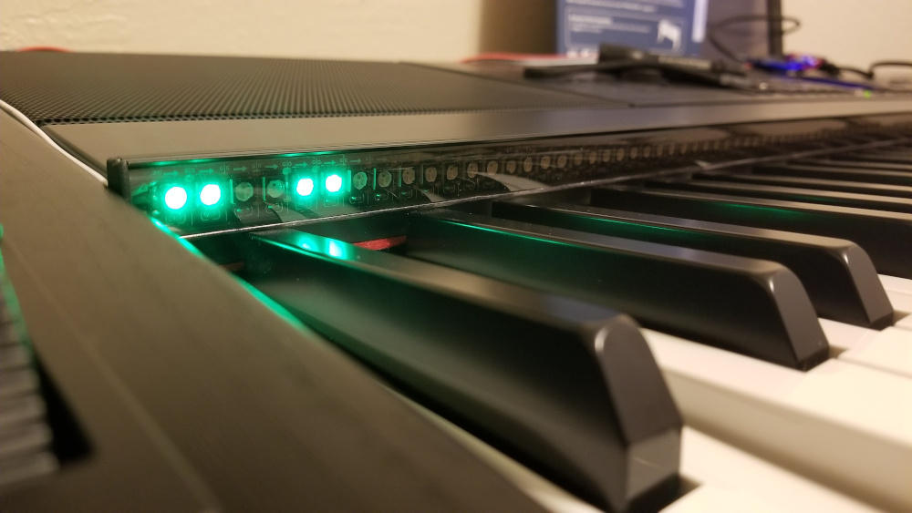

# PianoLights

Bluetooth MIDI device to power led strip and highlight the usb-midi piano keys. If you like Rousseao
youtube channel with nice piano lights - it's your way to get the similar effect.

## Hardware

* MC: ESP32 Dev Board (MELIFE ESP32 ESP-32S Development Board 2.4GHz Dual-Mode WiFi + BT)
* SPI USB controller: MAX3421E-based (HiLetgo 2.0 ADK Mini USB Host Shield SLR SPI)
* 2 USB cables: first to power the device & LED strip and another to connect to MIDI piano
* RGB LED strip: WS2812B RGB 5050SMD Individual Addressable 3.3FT 144(2X72) Pixels/m
* 22 AWG 3-wire cable line
* LED channel: Muzata Black LED Channel System, Smoke Transparent Diffuser, 6.6FT/2Meter U Shape U1SW BB 2M,LU1 L2M
* Soldering iron, some wires, capacitor 470μF/25V & resistor 330Ohm, double tape to stick 2 boards together

## Features

* Non-destructive addon to your piano or midi keyboard
* Compact and not pricey (~$40)
* Bluetooth LE MIDI -> USB-MIDI proxy
* Supports Synthesia piano lights feature
* Choose colors & transitions
* Supports different ranges of keys number and leds per key

## HowTo Use

### Android

1. Download `MIDI BLE Connect` application from Google Play
2. Connect `PianoLights` device to your powered piano via USB and power it up
3. Make sure the `PianoLights BLE` is not paired with your Android already
4. Run the `MIDI BLE Connect` application and find the `PianoLights BLE` in the list
5. Now the device available as MIDI, while the `MIDI BLE Connect` is running
6. Go to **Synthesia setup** chapter

### Synthesia setup

1. Switch to Synthesia (do not use `back` button, only `home` or `switch app` ones)
2. Go to `Settings --> Music Devices` and select "Android M MIDI" in `Device Connection Method`
3. Now you will see the `PianoLights BLE` in the `Music Input` and `Music Output` lists
4. Select the `PianoLights BLE` in `Music Input` list
5. Enable input for device and setup as usual - press lowest and highest key on your piano
6. Go back to `Music Devices` and select `PianoLights BLE` in the `Music Output` list
7. Enable output for the device
8. Disable `My Notes` switch - otherwise they will be duplicated
9. If you want the LED to highlight keys to press feature - click on `Key Lights` item and select
the 16th MIDI channel in the list - you will see that some LEDs are white and moving right.
10. Other defaults should be ok

## DIY info

**WARNING**: the LED strip contains 176 RGB LEDs which in full brightness could consume > 10A. The
logic contains `POW_BUDGET_*` constants which limiting the potential usage to make sure the led
strip will consume less then constrains (wires, power source) could provide.

This project is DIY, so you will need to apply some non-trivial soldering skills and properly tuned
hands.

### Tricky moments

* **LED Strip**
  The most tricky one - it contains 144 pixels/m, but we need 146 pixels/m, because standard piano
  contains 88 keys / 1200mm (side keys are wide, so we use just half of them), means 176 LEDs total.
  You see - 2 more LED's means we will need to resolder the strip with cutting small parts of strip
  in between the LEDs. This way you will get perfect 2 LEDs per key.
* **Strip 3-wire cable**
  Of course you can use higher gauge to support more current through, but it's better to find the
  max of your power source (piano USB host). 22 AWG could provide ~2.4A, so for minimal
  functionality (200mA) that's more then enough. If you worrying about potential fire - put a simple
  fuse on LED power rail.
* **LED channel**
  To mount the led strip properly - better to use some case. Thin aluminium LED channel is perfect
  for that, but it could be not so thin as required. So you can cut one side of profile, cut the
  plastic cover and combine them together.
* **ESP32s dev board**
  Consumes quite alot of power, so you can try to use another board - but be prepared to change the
  source code to fit in your microcontroller constraints.

### Useful links

* ESP32 arduino: https://github.com/espressif/arduino-esp32
* MIDI BLE Connect source code: https://github.com/philburk/android-midisuite/tree/master/MidiBtlePairing

### Arduino IDE configuration

* ESP32 Dev Module
* Flash Mode: QIO
* CPU frequency: 240MHz (WiFi/BT)
* Flash Size: 4MB (32Mb)
* Partition scheme: default 4MB with spiffs (1.2MB app/1.5MB SPIFFS)
* Flash frequency: 80MHz
* Upload speed:921600
* Core debug level: none
* PSRAM: disabled
* Port: ttyUSB0

#### Libraries

The project uses a number of libraries you need to download from IDE:

* [ESP32 Digital RGB LED Drivers](https://github.com/MartyMacGyver/ESP32-Digital-RGB-LED-Drivers)
  To control the LED strip
* [USB Host Shield Library 2.0](https://github.com/felis/USB_Host_Shield_2.0)
  To interact with USB board via SPI

### Build code

Just check the configuration section, make sure the settings is ok and that all the libs is here,
press `Upload` button in your Arduino IDE and everything should be fine.

## OpenSource

This is an experimental project - main goal is to test State Of The Art philosophy in practice.

We would like to see a number of independent developers working on the same project issues
for the real money (attached to the ticket) or just for fun. So let's see how this will work.

### License

Repository and it's content is covered by `Apache v2.0` - so anyone can use it without any concerns.

If you will have some time - it will be great to see your changes merged to the original repository -
but it's your choice, no pressure.
